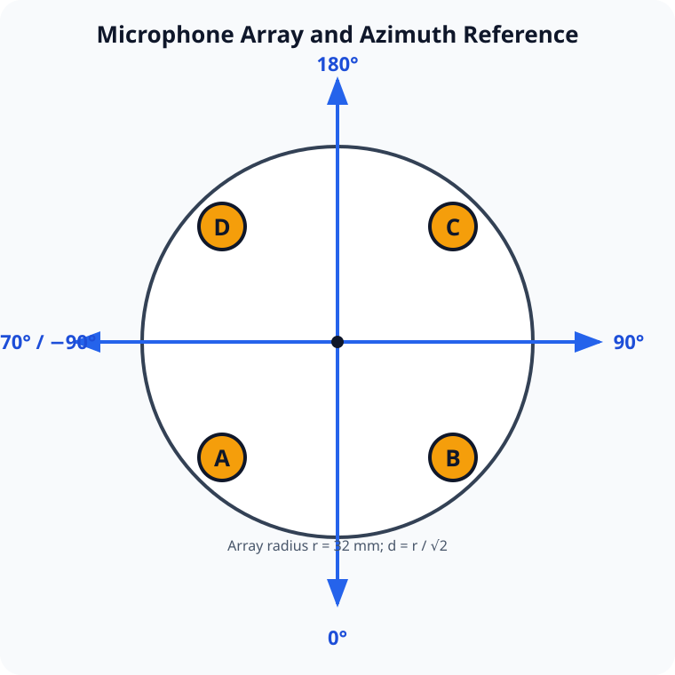

# UAV Acoustic Direction Finding

Real-time-oriented acoustic direction finding for UAV detection using a synchronized four-microphone array and an SRP-PHAT signal-processing pipeline.

## Overview

The project analyzes a multichannel WAV recording in short snapshots and estimates the direction of arrival (DOA) of a UAV acoustic source. It combines energy selection, spectral features, SRP-PHAT beamforming, multiband analysis, confidence scoring, optional noise-floor estimation, and temporal smoothing.

The current implementation processes recorded WAV files. It is a research prototype and should not be treated as a validated safety, security, or aviation system.

## Hardware and input format

The current geometry targets a reSpeaker V3 USB 4Mic-ARRAY XVF3000. The source code defines a square four-microphone geometry with a 32 mm radius.



The physical convention is `A` lower-left, `B` lower-right, `C` upper-right, and `D` upper-left. Azimuth is defined as `0°` down, `90°` right, `180°` up, and `270°` (equivalent to `-90°`) left.

Input requirements:

- A multichannel WAV recording with at least six channels
- Microphone channels selected by zero-based indices `[1, 2, 3, 4]`
- A sample rate high enough to cover the configured analysis bands
- Optional multichannel noise-reference WAV recording

Verify the channel map for your own hardware before relying on the output.

## Repository layout

```text
.
├── data/                  Local WAV recordings (not committed)
├── docs/                  Project documentation
├── results/               Generated outputs and synthetic examples
├── src/                   Analysis implementation
├── tests/                 Unit tests
├── requirements.txt       Python dependencies
└── README.md
```

## Installation

Python 3.10 or newer is recommended.

```bash
python -m venv .venv
```

Activate the environment on Windows:

```powershell
.venv\Scripts\Activate.ps1
```

Activate it on macOS or Linux:

```bash
source .venv/bin/activate
```

Install dependencies:

```bash
python -m pip install -r requirements.txt
```

## Usage

Place recordings in `data/` or provide explicit paths:

```bash
python src/uav_acoustic_direction_finding.py \
  --input data/input.wav \
  --noise-reference data/analiz.wav \
  --output results \
  --mode circle
```

For a non-interactive run that saves plots without opening windows:

```bash
python src/uav_acoustic_direction_finding.py --input data/input.wav --mode hover --no-show
```

Available modes:

- `circle`: shorter snapshots and lighter smoothing for moving targets
- `hover`: longer snapshots and stronger smoothing for relatively stable targets

Run `python src/uav_acoustic_direction_finding.py --help` for all options.

## Real-time radar interface

The repository also includes an experimental PyQt-based interface that can replay a WAV recording or read a live multichannel ReSpeaker input:

```bash
python src/realtime_radar.py
```

Live capture requires a working PortAudio-compatible input device and the `sounddevice`, `PyQt5`, and `pyqtgraph` packages listed in `requirements.txt`. Select and verify the six-channel device in the interface before starting capture. The real-time detector is experimental and must not be used as a safety-critical alarm.

## Outputs

Each run creates a directory under `results/` named after the input recording. Outputs can include:

- `snapshot_summary.csv`
- `per_second_summary.csv`
- `harmonic_summary.txt`
- DOA-over-time plots
- DOA heatmaps and beam-power scans
- Spectrogram and average-spectrum plots
- Detection and confidence timelines
- Presentation notes

Synthetic example plots, when present, are explicitly marked as illustrations and are not experimental evidence.

## Tests

Run the unit tests from the repository root:

```bash
python -m unittest discover -s tests -v
```

The initial suite checks angle wrapping, circular angular distance, channel selection, validation behavior, and mode configuration.

## Recording protocol

The available experiment catalog contains 85 planned recordings covering fixed angles, moving paths, two target heights, multiple horizontal distances, fan-noise conditions, and empty-room controls. See [docs/recording_protocol.md](docs/recording_protocol.md). Raw WAV recordings are intentionally not published.

## Limitations

- Accuracy depends on microphone synchronization, geometry, calibration, sample rate, acoustic reflections, background noise, and source spectrum.
- The fixed channel selection may need adjustment for other devices.
- The parameters are research defaults and have not been validated across all UAV types or environments.
- Synthetic examples must not be interpreted as measured performance.
- The included live-streaming radar mode is experimental and has not been validated as a safety-critical detector.

## License

Released under the MIT License. See [LICENSE](LICENSE).
